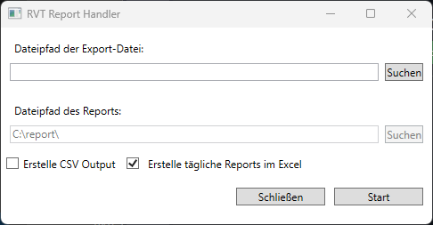

# RVT Report Creator

The RVT Report Creator is a WPF program to convert the exported dada of an Eurotherm measuring transducer to a monthly report.

## Installation

Download the latest release from the [releases page](https://github.com/reiterpeter404/rvt-report-creator/releases/) according to your operating system.
After downloading the application, you can start it by double-clicking the executable file.

## Usage

The application is designed to convert the export of an Eurotherm measuring transducer to a monthly report. The export file must be in the TXT or CSV format. The application will read the file and create an Excel sheet containing the report.

## Additional Information

After starting the application, the following window will appear:

In this window several options are available:

1. **File path of the export file**: Insert or search for the file path of the export file you get from the Eurotherm controller.
2. **File path of the report**: The file path where the report will be saved. This option is currently disabled and cannot be changed. This will change in a future release.
3. **Create CSV Output**: If this option is checked, the output will additionally create a CSV file with the statistical values of each day of a month.
4. **Create daily reports in Excel**: If the option is checked, the Excel file will create an additional sheet for each day of the month. The name of each sheet will be in the format 'DD-MM'.
5. **Close**: Close the application.
6. **Start**: Start the conversion process. The finished report will be stored in the same directory as the export file.

## Errors

By running the program, you may encounter the following errors:

* **No file found**: Insert a valid file path for the export file. Insert the correct path and try again.
* **File does not exist**: The given input path is not valid. Check the path and try again.
* **An Excel file is created but without content**: Check the CSV file from the Eurother controller and make sure it has the encoding 'UTF-8' or 'UTF-16 LE'. This can be done by opening an editor (Notepad, Visual Studio Code, etc.) and checking the encoding in the status bar.
* **The exported report does not contain all data**: Make sure that the export file contains all data needed. Additionally, the measurements of one day will not be added to the report, if less than 10 entries are available. This is to prevent incorrect data in the report.
* **Other errors**: Please create an issue in the [issue tracker](https://github.com/reiterpeter404/rvt-report-creator/issues) and describe the error in detail. Add the label **Bug** to the issue to mark is as a bug.
